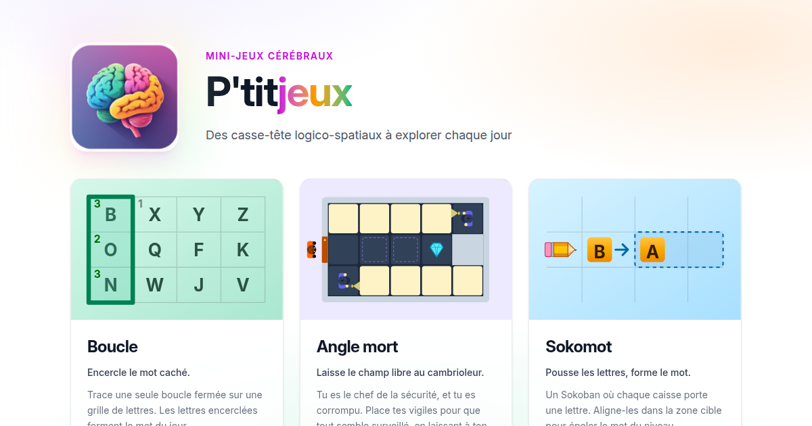
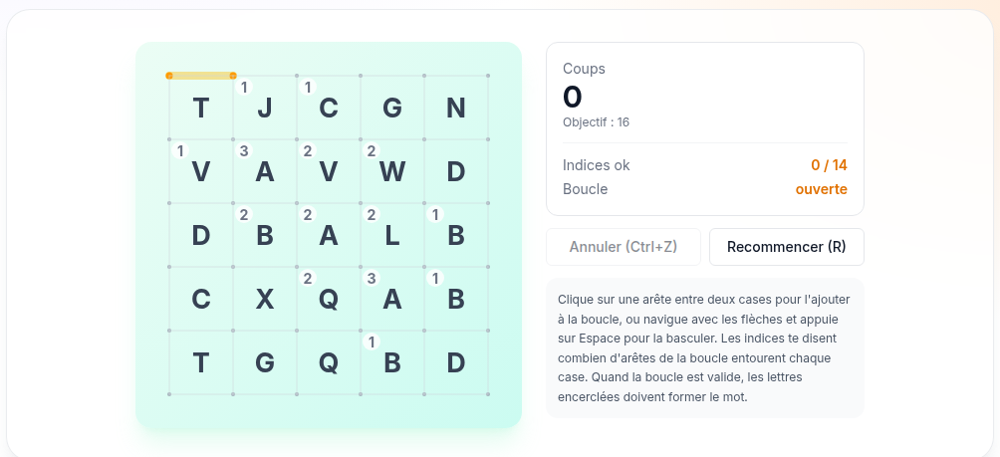
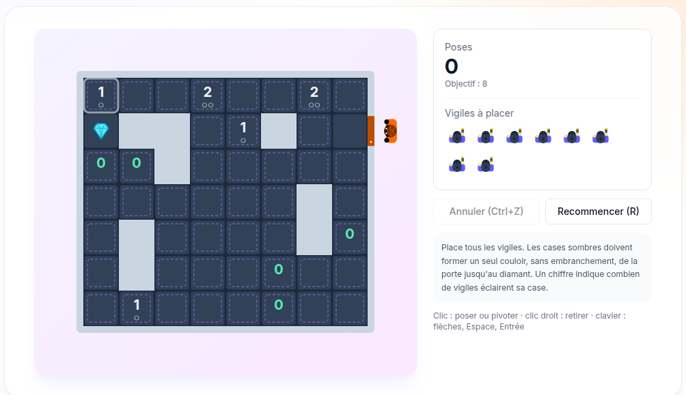
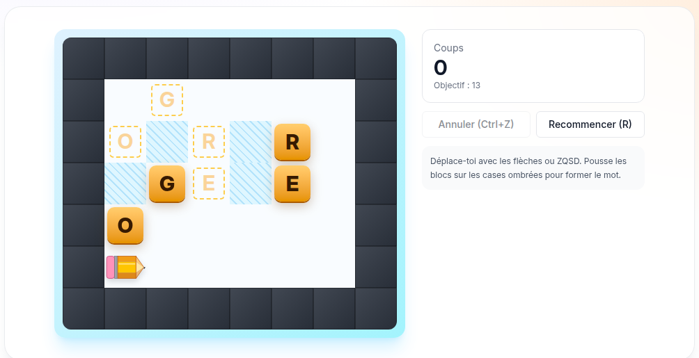
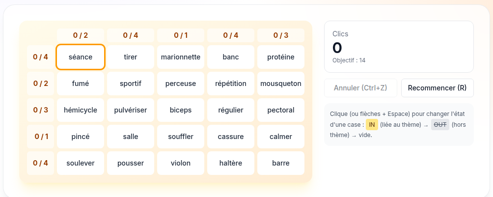

<div align="center">


# P'titjeux

**Des casse-tête logico-spatiaux à explorer chaque jour : quatre petits jeux, quatre
niveaux par jour, de plus en plus grands.**

[**Jouer**](https://ptitjeux.yavadeus.dev) &nbsp;·&nbsp;
[Les jeux](#les-jeux) &nbsp;·&nbsp;
[Comment ça marche](#comment-ça-marche) &nbsp;·&nbsp;
[Documentation technique](AGENTS.md)

<a href="https://ptitjeux.yavadeus.dev">
  
</a>

<sub>
  100 % front-end &nbsp;·&nbsp; React Router 7 + React 19 &nbsp;·&nbsp; TypeScript strict &nbsp;·&nbsp;
  Tailwind CSS v4 &nbsp;·&nbsp; niveaux générés et prouvés hors ligne &nbsp;·&nbsp; licence MIT
</sub>

</div>

---

## Les jeux

Chaque jeu propose **quatre niveaux par jour**. Le niveau suivant se débloque quand le
précédent est résolu, et chaque niveau a un objectif de coups : le battre donne un
résultat **parfait**.

### Boucle

**Encercle le mot caché.** Trace une seule boucle fermée sur une grille de lettres : les
chiffres disent combien de côtés de chaque case la boucle emprunte, et les lettres
encerclées forment le mot du jour. Un Slitherlink avec un mot à trouver.



### Angle mort

**Laisse le champ libre au cambrioleur.** Tu es le chef de la sécurité, et tu es
corrompu. Place tes vigiles et oriente leurs lampes pour que toute la salle soit
éclairée, sauf un couloir unique, de la porte jusqu'au diamant, par lequel passera ton
complice. Les piliers et les vigiles arrêtent la lumière, les chiffres disent combien de
lampes éclairent une case, et au niveau 4 des miroirs renvoient les faisceaux. Le seul
jeu sans mot : du placement pur.



### Sokomot

**Pousse les lettres, forme le mot.** Un Sokoban où chaque caisse porte une lettre :
aligne-les dans la zone cible pour épeler le mot du niveau.



### Sémantogramme

**Découvre le thème par recoupement.** Une grille de mots : les chiffres en marge disent
combien de mots de chaque ligne et de chaque colonne sont liés au thème caché.
Identifie-les tous, puis devine le thème. Un Nonogram croisé avec Semantle.



Tout se joue aussi **au clavier** : flèches (ou ZQSD / WASD), Espace et Entrée pour agir,
Ctrl+Z pour annuler, R pour recommencer, Échap pour revenir à la liste. Sur l'accueil et
les listes de niveaux, les flèches déplacent le focus d'une carte à l'autre.

## Comment ça marche

### Pas de serveur

Les niveaux sont des fichiers JSON livrés avec le site, un par jour et par niveau. La
progression reste dans le navigateur (`localStorage`) : pas de compte, rien ne sort de
l'appareil. Seules les définitions des mots trouvés sont demandées au Wiktionnaire, à
la victoire.

### Des niveaux prouvés avant d'être publiés

Les niveaux ne sont pas générés pendant la partie : un générateur les produit à l'avance
(`make generate-levels`), et **chaque niveau publié a un test qui le résout**. Un niveau
que le générateur n'a pas su résoudre lui-même ne peut pas être livré, et un changement
dans un moteur de jeu fait immédiatement échouer les niveaux qu'il casserait.

### Deux ou trois choses qui n'étaient pas évidentes

- **Angle mort ne garantit pas une seule pose, mais un seul couloir.** Exiger que la
  solution soit unique rendait la génération des grands niveaux interminable (plus de
  deux heures sans une grille). Ce que le joueur doit trouver, c'est le couloir : on
  énumère donc les couloirs que les indices permettent encore, puis un solveur vérifie,
  couloir imposé, qu'aucune pose ne produit les autres. Un « 0 » oblige le couloir à
  passer par sa case, un chiffre positif le lui interdit. La preuve tombe en quelques
  secondes, et plusieurs poses gagnantes peuvent mener au même couloir.
- **Une grille d'Angle mort sert huit fois.** Rotations et symétries conservent la
  solution et son unicité : 50 grilles de base donnent 13 mois de défis, sans jamais
  revoir la même grille dans le mois.
- **Les miroirs remplacent des vigiles.** Plutôt que de poser des miroirs au hasard, le
  générateur cherche un vigile qui reçoit déjà un faisceau par le côté : un miroir à sa
  place renvoie ce faisceau sur sa ligne, et ses cases restent éclairées avec un vigile
  de moins. Chaque miroir gardé est indispensable.
- **Les mots s'affichent sans accents, mais se cherchent avec.** La grille ne connaît que
  les lettres A à Z ; chaque mot garde aussi sa forme accentuée, celle qu'on envoie au
  Wiktionnaire pour sa définition.

## Démarrer

```sh
make install        # Node 24 requis (voir .nvmrc)
make start          # http://localhost:2222
```

| Commande | Effet |
|---|---|
| `make check` | build + lint + typecheck + tests (avant chaque commit) |
| `make test` | tests unitaires, de composants et d'intégrité des niveaux |
| `make verify-levels` | vérifications lourdes : unicité de chaque niveau, générateurs sur un large échantillon de dates |
| `make generate-levels` | régénère les défis quotidiens (à la demande uniquement) |

Stack : React Router 7 (mode framework), React 19, TypeScript strict, Vite, Tailwind CSS
v4, Vitest et Testing Library.

## Documentation

| Document | Contenu |
|---|---|
| [docs/new-games.md](docs/new-games.md) | Règles détaillées et génération de chaque jeu |
| [docs/project-plan.md](docs/project-plan.md) | Architecture et plan d'ensemble |
| [docs/existing-games.md](docs/existing-games.md) | Les jeux qui ont inspiré le projet |
| [generators/README.md](generators/README.md) | Générateurs et dictionnaire |
| [AGENTS.md](AGENTS.md) | Arborescence, conventions, commandes |

## Licence

[MIT](LICENSE). Le dictionnaire français utilisé à la génération provient du paquet
[`an-array-of-french-words`](https://github.com/words/an-array-of-french-words) (MIT,
Titus Wormer).

---

<div align="center">
  <sub>
    Made with ❤️ by
    <a href="https://github.com/JulienMattiussi/ptitjeux"><b>YavaDeus</b></a>
  </sub>
</div>
